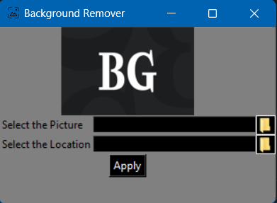

# Background Remover

Background Remover is a Python application that allows you to remove the background from an image and save it as a transparent PNG file.

## How to Use

1. Clone the project to your computer or download it as a zip file.

2. Python 3 must be installed. If it's not installed, you can download it from the [Python download page](https://www.python.org/downloads/).

3. Install the required Python libraries using the following command:

pip install pillow rembg

4. Run the application by executing the `background_remover.py` file.

5. Click the "Select the Picture" button to choose the image from which you want to remove the background.

6. Click the "Select the Location" button to specify where you want to save the background-removed image.

7. Click the "Apply" button to remove the background and save the image.

## Screenshot

---

**Note:** This application is designed for removing backgrounds from images and is for educational purposes only. Make sure you have the necessary rights to use and modify images.

If you would like to contribute to the development of the project, please feel free to submit a pull request or report any issues.
